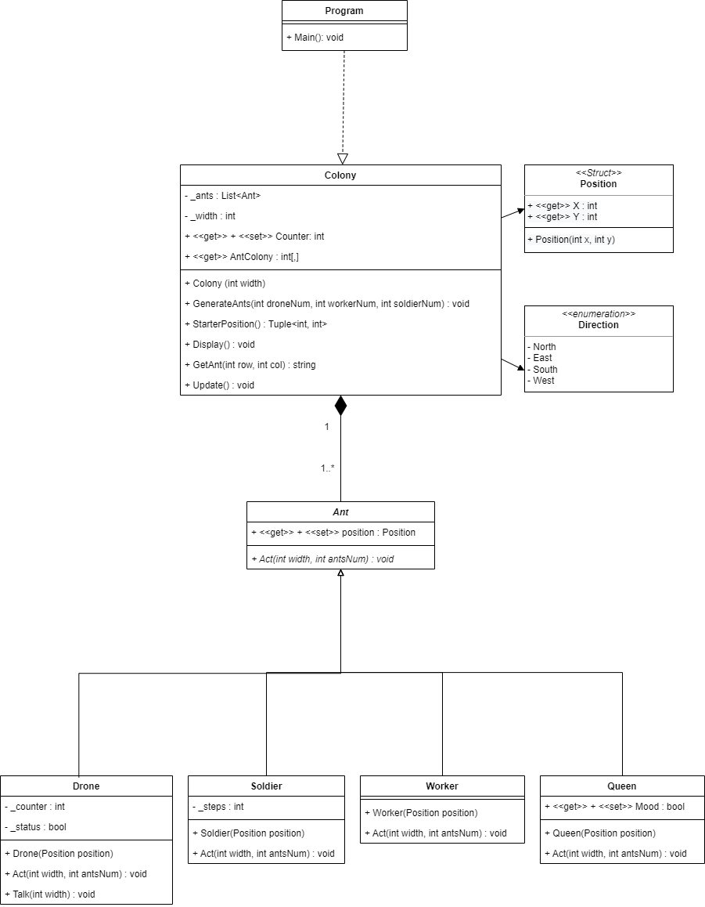

# Life-of-the-Ants

Zero-player, simulation game about the life of an ant colony.

In an ant colony, there are four different castes: workers, soldiers, drones, and there is one queen.

The colony area is square, and the ants live and move within the borders of the colony.

Each ant acts in every timestep, according to a caste-specific rule.
- The queen sits in the middle and does not move.
- Workers normally make one step in one of the four directions, chosen randomly before each move.
- Soldiers "patrol" close to their starting position; this means that in a four-cycle, they step one and turn to the left (towards North, East, South, or West) and then they start the cycle again.
- Drones always try to make one step towards the Queen. When they get next to the queen, they have a chance that she is in the mood for mating. In this happy case, they say "HALLELUJAH", and stay there for 10 timesteps. After that they are kicked off in one of the four directions (chosen randomly), to the edge of the colony. If the queen isn't in the mood, drones say ":(", and are kicked away instantly.

The queen’s mating mood is determined using a cooldown timer after a successful mating. When the timer runs out, she gets in the mood again.

### UML



### Instruction:

To start:
```
Open the LifeOfAnts.sln in Visual Studio then press Ctrl+F5 or select the green Start button from the top menu.
```
